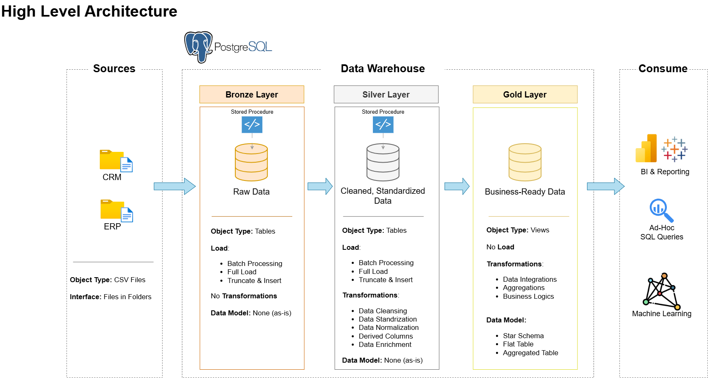

# Data Warehouse and Analytics Project with **Baraa**

This project presents a full end-to-end data warehousing and analytics ecosystem, covering everything from architecting the warehouse to producing meaningful, data-driven insights. Built as a portfolio showcase, it reflects established industry standards in modern data engineering and analytical design.

---

## The Data Warehouse project

### 🏗️ Data Architecture

The data architecture for this project follows Medallion Architecture **Bronze**, **Silver**, and **Gold** layers:


1. **Bronze Layer**: Stores raw data as-is from the source systems. Data is ingested from CSV Files into SQL Server Database.
2. **Silver Layer**: This layer includes data cleansing, standardization, and normalization processes to prepare data for analysis.
3. **Gold Layer**: Houses business-ready data modeled into a star schema required for reporting and analytics.

---

### 📖 Project Overview

This project involves:

1. **Data Architecture**: Designing a Modern Data Warehouse Using Medallion Architecture **Bronze**, **Silver**, and **Gold** layers.
2. **ETL Pipelines**: Extracting, transforming, and loading data from source systems into the warehouse.
3. **Data Modeling**: Developing fact and dimension tables optimized for analytical queries.
4. **Analytics & Reporting**: Creating SQL-based `(PostgreSQL)` reports and dashboards for actionable insights.

### 📂 Project Structure

```
data-warehouse-project/
│
├── datasets/                           # Raw datasets used for the project (ERP and CRM data)
│   ├── source_CRM/                     # source folder for CRM files
│       ├── cust_info.csv               # customer information CSV file
│       ├── prd_info.csv                # product information CSV file
│       ├── sales_details.csv           # sales details CSV file
|
│   ├── source_CRM/                     # source folder for CRM files
│       ├── CUST_AZ12.csv               # customer information CSV file
│       ├── LOC_A101.csv                # location information CSV file
│       ├── PX_CAT_G1V2.csv             # product information CSV file
│
├── docs/                               # Project documentation and architecture details
│   ├── data_architecture.png           # png file shows the project's architecture
│   ├── data_catalog.md                 # Catalog of datasets, including field descriptions and metadata
│   ├── data_flow.drawio                # Draw.io file for the data flow diagram
│   ├── data_models.drawio              # Draw.io file for data models (star schema)
│   ├── naming-conventions.md           # Consistent naming guidelines for tables, columns, and files
│
├── sql_scripts/                        # SQL scripts for ETL and transformations
│   ├── bronze/                         # Scripts for extracting and loading raw data
│   ├── silver/                         # Scripts for cleaning and transforming data
│   ├── gold/                           # Scripts for creating analytical models
│   ├── intial_database.sql             # Scripts for creating database and schemas
│
├── tests/                              # Test scripts and quality files
│   ├── quality_checks_gold.sql         # Test scripts to check data quality in the gold layer
│   ├── quality_checks_silver.sql       # Test scripts to check data quality in the silver layer

```

---

## The EDA projects

### 📖 Project Overview

This project involves:

1. **Data Warehouse Design**: Creating a structured analytics database with **dimension** and **fact** tables in the `gold` schema.  
2. **Data Integration**: Importing and transforming customer, product, and sales datasets into the warehouse.  
3. **Metrics & KPIs**: Aggregating key business metrics like total sales, orders, and customer activity.  
4. **Advanced Analytics**: Performing segmentation, ranking, cumulative, and time-based analyses with SQL `(PostgreSQL)` reports for actionable insights.


### 📂 Project Structure

```
sql-data-analytics-project/
│
├── datasets/
│   ├── csv-files/
│   │   ├── **Bronze Layer (Raw/Staging Data)**
│   │   │   ├── bronze.crm_cust_info.csv
│   │   │   ├── bronze.crm_prd_info.csv
│   │   │   ├── bronze.crm_sales_details.csv
│   │   │   ├── bronze.erp_cust_az12.csv
│   │   │   ├── bronze.erp_loc_a101.csv
│   │   │   ├── bronze.erp_px_cat_g1v2.csv
│   │   │
│   │   ├── **Silver Layer (Cleaned/Integrated Data)**
│   │   │   ├── silver.crm_cust_info.csv
│   │   │   ├── silver.crm_prd_info.csv
│   │   │   ├── silver.crm_sales_details.csv
│   │   │   ├── silver.erp_cust_az12.csv
│   │   │   ├── silver.erp_loc_a101.csv
│   │   │   ├── silver.erp_px_cat_g1v2.csv
│   │   │
│   │   ├── **Gold Layer (Analytical Data Models)**
│   │   │   ├── gold.dim_customers.csv
│   │   │   ├── gold.dim_products.csv
│   │   │   ├── gold.fact_sales.csv
│   │   │   ├── gold.report_customers.csv
│   │   │   ├── gold.report_products.csv
│   │   │
│   ├── DataWarehouseAnalytics.bak           # Database backup file
│
├── docs/                                     # Project documentation
│   ├── Project Roadmap.pdf
│   ├── Project Roadmap.png
│   ├── Project_Notes_Sketches.pdf
│
├── scripts/                                  # SQL scripts for setup and analysis
│   ├── 00_init_database.sql                 # Database initialization/setup
│   ├── **Data Exploration Scripts**
│   │   ├── 01_database_exploration.sql
│   │   ├── 02_dimensions_exploration.sql
│   │   ├── 03_date_range_exploration.sql
│   │   ├── 04_measures_exploration.sql
│   │
│   ├── **Analytical Scripts**
│   │   ├── 05_magnitude_analysis.sql
│   │   ├── 06_ranking_analysis.sql
│   │   ├── 07_change_over_time_analysis.sql
│   │   ├── 08_cumulative_analysis.sql
│   │   ├── 09_performance_analysis.sql
│   │   ├── 10_data_segmentation.sql
│   │   ├── 11_part_to_whole_analysis.sql
│   │
│   ├── **Reporting Scripts**
│   │   ├── 12_report_customers.sql
│   │   ├── 13_report_products.sql
```

---

# Data Warehousing Notes

A concise set of notes I created after watching two advanced YouTube tutorials by **Ansh Lamba** and completing a portion of the **"Data Warehouse - The Ultimate Guide"** course on Udemy. These notes cover Data Warehousing, Dimensional Data Modeling, ETL architecture, Incremental Loading, and SCD implementations. All notes are now part of my GitHub repository so I can revisit the concepts anytime and expand my collection as I continue learning. 🚀

## 📘 What I Watched / Studied

1. **[Data Warehouse – The Ultimate Guide [2025] (YouTube)](https://www.youtube.com/watch?v=HKcEyHF1U00&t=8939s)**
2. **[Data Modeling Masterclass for Data Engineers [2025] (YouTube)](https://www.youtube.com/watch?v=K7C1sWKQU-o)**
3. **[Data Warehouse - The Ultimate Guide (Udemy)](https://www.udemy.com/course/data-warehouse-the-ultimate-guide/)** — notes uploaded for the completed sections.

## 📂 GitHub

The full notes are available in this repository, and I will keep adding more resources and learning materials as I progress through my Data Engineering journey.

### 📄 Notes Documents

- **[YouTube Notes (PDF)](Data%20warehousing%20and%20data%20modeling.pdf)**
- **[Udemy Notes (PDF)](Data%20warehouse.pdf)**
